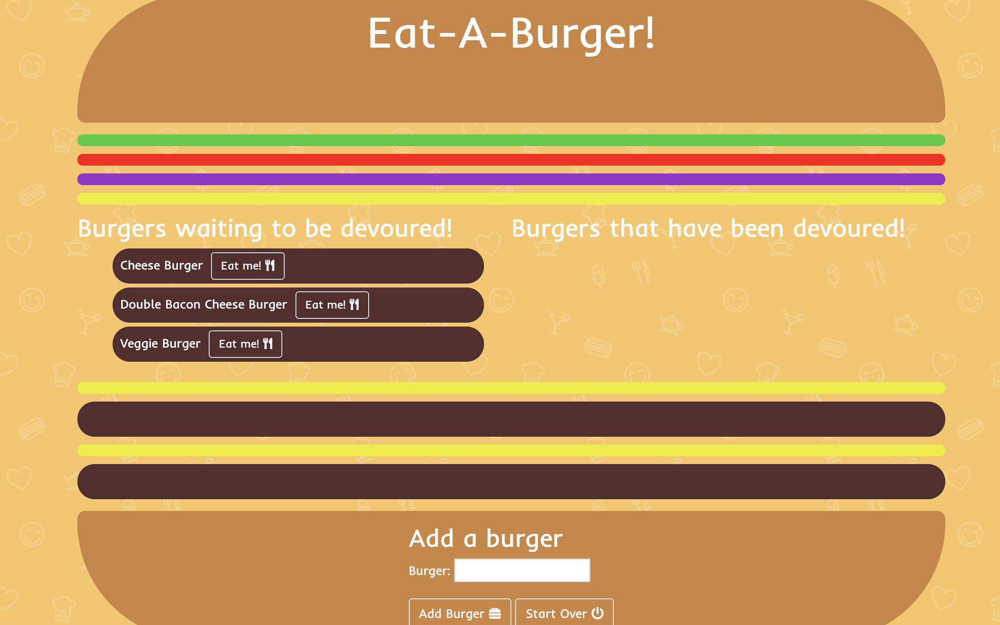

# Eat-A-Burger!

Eat A Burger is a full stack application made using Javascript, J-Query, HTML, CSS, Express, MySQL, Node, HandleBars, and an ORM. The Eat-A-Burger file structure was created using the MVC design model. 

Check me out!: https://glacial-headland-24860.herokuapp.com/

## Installation

Clone this repository locally, and then install the needed dependencies. Run the server via node. 
```bash
git clone https://github.com/Cmader555/handleBarBurger.git

npm install

node server
```

## Usage

Click on the eat me button next to any burger waiting to be devoured. 
Clicking on the button changes the boolean value of the burger from false to true, and the burger gets added to the devour column. 
Adding a burger stores the new burger inside of a database, and that new burger is displayed. You can completely start over, which removes all burgers from the database except for the original three, and it resets their values to false. 

## Preview



## Authors

**Christian Mader**
